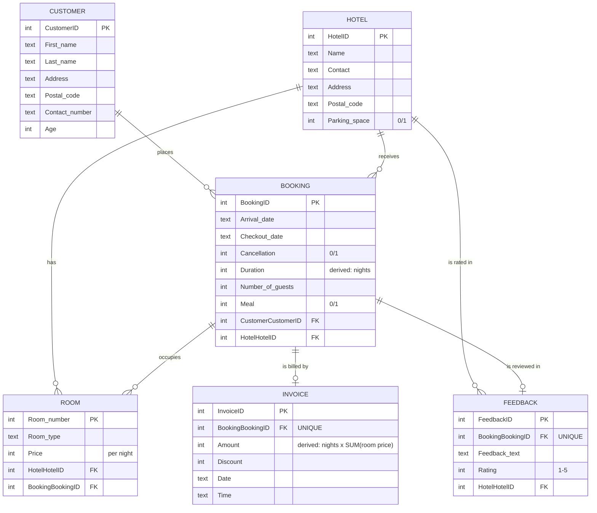

# MAGS: Hotel-Booking Platform with Polyglot Persistence

> ### All data in this repository is synthetic
> Every customer, hotel, booking, room, invoice and review is fictional and
> generated by [`sql/seed.sql`](sql/seed.sql). No real booking data is used
> anywhere. The generator also **deliberately** gives lower-rated hotels a
> higher cancellation rate, so the relationship the analysis recovers was put
> into the data on purpose. Treat the figures below as a demonstration of
> method on a dataset with known structure, not as evidence about real hotels.
> Every number in this README is printed by code in this repository
> (`python analysis.py`, or the test suite); none is typed in by hand.

A back-end data layer for an online hotel-booking agency ("MAGS"), built on
**polyglot persistence**: a normalised **SQLite** relational core for
transactional bookings and a **MongoDB** document store for the searchable hotel
catalogue. Includes a Python CRUD layer, automated invoicing, schema-enforced
integrity rules, a revenue-at-risk analysis, and a test suite.

> Originally built as group coursework for **BEMM459J: Database Technologies for
> Business Analytics** (University of Exeter Business School). Cleaned up,
> documented, hardened, and made reproducible for this portfolio. See
> [Team & my contribution](#team--my-contribution).
> **Published with my teammates' consent.**

---

## The business problem

An online travel agency needs its data layer to do two jobs that pull in opposite directions:

| Job | Characteristics | Right tool |
|---|---|---|
| **Transactional bookings** | Customers, reservations, invoices, feedback. Correctness and referential integrity are critical. You must not be able to invoice a booking that does not exist. | A **relational** database with ACID guarantees and foreign keys. |
| **Catalogue search** | A read-heavy, schema-flexible hotel directory (name, stars, city, country) queried constantly by shoppers. | A **document** store optimised for flexible, fast reads. |

Forcing both into one engine compromises one of them. This project demonstrates
using **the right store for each workload**, the core idea behind polyglot
persistence.

## Datastore-choice rationale

| Concern | SQLite (relational core) | MongoDB (catalogue) |
|---|---|---|
| Primary use | Transactions: bookings, invoices, feedback | Search/browse: hotel directory |
| Data shape | Highly structured, 3NF, many relationships | Semi-structured, few relationships, evolves over time |
| Integrity | **Foreign keys enforced**, plus CHECK and UNIQUE constraints; ACID | Eventual/flexible, no cross-document FKs needed |
| Access pattern | Joins + aggregations for analytics | High-volume key/field reads |
| Why chosen here | Invoicing logic depends on joins across Booking/Room; correctness matters | Catalogue fields change without migrations; reads dominate |

## Results at a glance

- A normalised **6-table 3NF schema** with enforced foreign keys (`PRAGMA foreign_key_check` returns zero rows on build).
- Integrity enforced by the schema itself: a stay must end after it starts, and a booking carries **at most one invoice and at most one review**.
- A reusable, **parameterised** Python CRUD layer over SQLite, with an allow-list for table and column identifiers.
- **Automated invoicing**: `Amount = nights x SUM(nightly price of every room on the booking)`.
- A **250-booking** synthetic dataset built deterministically, so two builds of the database are byte-identical.
- A **revenue-at-risk analysis** that ranks hotels by money lost to cancellations rather than by cancellation rate, and shows the two rankings disagree.
- **36 tests** asserting numeric outcomes, including a regression test for the invoicing defect and tests that the CHECK and UNIQUE constraints actually reject bad rows.
- A parallel **MongoDB** catalogue that runs against a live server *or* an in-memory `mongomock` stand-in, so the whole project is reproducible with no database daemon.

## The analysis: which hotels lose the most revenue to cancellations?

Ranking hotels by cancellation *rate* is the obvious move and it is the wrong
one. A small, cheap property can cancel a third of its bookings and still cost
less than a large, expensive one cancelling a quarter. Ranking by money changes
the answer.

Verbatim output of `python analysis.py`:

```
Dataset: 250 bookings across 10 hotels (synthetic; see sql/seed.sql).

Revenue at risk from cancellations, worst first
                            hotel  bookings  cancel_rate_pct  booked_revenue  lost_revenue  lost_share_pct  avg_rating  reviews
Hampton by Hilton London Waterloo        29             27.6           75252         22563            30.0        1.31       13
    Grand Royale London Hyde Park        29             20.7           52266         14857            28.4        2.15       20
                Astor Court Hotel        29             20.7           38026          7891            20.8        3.00       19
                      The Montana        20             30.0           21435          3125            14.6        1.30       10
                 New Linden Hotel        18             11.1           31964          2660             8.3        4.00       10
       Crowne Plaza London Ealing        20             10.0           17569          2115            12.0        1.75        8
                    The 29 London        28              3.6           25066          1240             4.9        3.67       18
            Sea Containers London        18              5.6           42791          1040             2.4        4.00       12
      Park Grand London Hyde Park        28              3.6           71999           956             1.3        4.84       19
              Dorsett City London        31              3.2           26216           111             0.4        4.78       23

Portfolio booked revenue          GBP 402,584
Portfolio revenue lost to cancels GBP 56,558 (14.0% of booked)
Top 3 hotels by loss              GBP 45,311 (80.1% of all losses, 34.8% of bookings)

Pearson r, avg rating vs cancellation rate: -0.841 (n = 10 hotels)
Worst by cancellation rate: The Montana (30.0%, GBP 3,125 lost)
Worst by revenue lost:      Hampton by Hilton London Waterloo (27.6%, GBP 22,563 lost)
```

**What it says.** Losses are concentrated: 80.1% of the money lost sits in three
of ten hotels, which carry 34.8% of bookings. The rate ranking and the money
ranking name different properties, so a remediation programme driven by
cancellation rate alone would start at The Montana (GBP 3,125 at stake) and
leave GBP 22,563 at Hampton by Hilton untouched.

**What it does not say.** The strong negative correlation between rating and
cancellation rate (r = -0.841) is structure the generator injects on purpose.
It is not a discovery. It is there so the analysis has a real relationship to
measure and the correlation code has something to be right about.

## Defects found and fixed

This repository was reworked from the original coursework submission. Four
correctness defects were reproduced first, then fixed, then locked with tests.

| Defect | Evidence it was real | Fix |
|---|---|---|
| **Invoice under-billing.** `Invoice.Amount` was derived by a correlated scalar subquery with no aggregate, so a booking with two rooms was billed for one of them, and a booking with no rooms billed `NULL`. | On the current dataset the old statement under-bills by **GBP 70,248** across **48 of 250** invoices. A booking of 18 nights holding a GBP 100 and a GBP 250 room billed GBP 1,800 instead of GBP 6,300. | `SUM(...)` wrapped in `COALESCE(..., 0)`. Regression test: `test_two_room_booking_bills_both_rooms`. |
| **No chronology rule.** Nothing stopped a checkout preceding an arrival; the derived `Duration` went negative (a booking with a `Duration` of -9 inserted cleanly). | Reproduced by inserting arrival `2022-04-10`, checkout `2022-04-01`. | `CHECK (Checkout_date > Arrival_date)` on `Booking`. |
| **No cardinality enforcement.** The ER diagram documented one invoice and one review per booking, but three invoices and two reviews for a single booking were all accepted. | Reproduced by inserting duplicates against booking 1000001. | `UNIQUE` on `Invoice.BookingBookingID` and `Feedback.BookingBookingID`. NULL still repeats, so unattributed reviews remain legal. |
| **BRD contradicted the schema** on three of six entities: `ROOM` (documented PK `RoomID`, actually `Room_number`, and its `BookingBookingID` FK was missing), `BOOKING` (documented a `RoomID` FK that does not exist), `FEEDBACK` (documented a `CustomerID` FK that does not exist). | Compared against `PRAGMA table_info` / `PRAGMA foreign_key_list` on a built database. | [`docs/BRD.md`](docs/BRD.md) reconciled to the delivered schema, with a note recording what changed. |

A fifth problem was scope, not correctness: ten rows per table cannot support
analysis. Every hotel had exactly one booking, so "bookings per hotel" returned
1 ten times and any average was a single observation. The seed now generates 250
bookings, and the analysis asks a question with a decision attached to it.

## Data model (6-table 3NF schema)



A booking holds **many** rooms (the key lives on `ROOM.BookingBookingID`), which
is exactly why the invoice total has to aggregate. It holds **at most one**
invoice and **at most one** review, and that is now enforced rather than merely
documented.

### Data dictionary

| Table | Column | Type | Key | Notes |
|---|---|---|---|---|
| **Customer** | CustomerID | INTEGER | PK | |
| | First_name / Last_name | TEXT | | not null |
| | Address / Postal_code | TEXT | | |
| | Contact_number | TEXT | | stored as text to preserve leading digits |
| | Age | INTEGER | | `CHECK (Age >= 0)` |
| **Hotel** | HotelID | INTEGER | PK | |
| | Name | TEXT | | not null |
| | Contact / Address / Postal_code | TEXT | | |
| | Parking_space | INTEGER | | boolean `0/1` |
| **Booking** | BookingID | INTEGER | PK | |
| | Arrival_date / Checkout_date | TEXT | | ISO 8601 `YYYY-MM-DD`; `CHECK (Checkout_date > Arrival_date)` |
| | Cancellation / Meal | INTEGER | | boolean `0/1` |
| | Duration | INTEGER | | **derived**: nights between dates |
| | Number_of_guests | INTEGER | | |
| | CustomerCustomerID | INTEGER | FK to Customer | not null |
| | HotelHotelID | INTEGER | FK to Hotel | not null |
| **Room** | Room_number | INTEGER | PK | |
| | Room_type | TEXT | | Single / Double / Triple / Studio |
| | Price | INTEGER | | per-night price |
| | HotelHotelID | INTEGER | FK to Hotel | not null |
| | BookingBookingID | INTEGER | FK to Booking | nullable: an unassigned room |
| **Invoice** | InvoiceID | INTEGER | PK | |
| | BookingBookingID | INTEGER | FK to Booking | not null, **UNIQUE**: one invoice per booking |
| | Amount | INTEGER | | **derived**: `nights x SUM(price of every room on the booking)` |
| | Discount | INTEGER | | stored but not applied to `Amount` (see Limitations) |
| | Date / Time | TEXT | | |
| **Feedback** | FeedbackID | INTEGER | PK | |
| | BookingBookingID | INTEGER | FK to Booking | **UNIQUE**: one review per booking; NULL may repeat |
| | Feedback_text | TEXT | | |
| | Rating | INTEGER | | `CHECK (Rating BETWEEN 1 AND 5)` |
| | HotelHotelID | INTEGER | FK to Hotel | not null |

## Tech stack

`Python`, `SQLite` (`sqlite3`), `MongoDB` (`pymongo` / `mongomock`), `pandas`,
`seaborn`, `Jupyter`, `unittest`.

## Repository layout

```
hotel-booking-polyglot-db/
├── notebooks/
│   └── hotel_booking_polyglot_db.ipynb   # documented, runs top-to-bottom
├── sql/
│   └── seed.sql                          # builds + seeds data/hotel.db from scratch
├── tests/
│   └── test_hotel_db.py                  # 36 tests with numeric oracles
├── docs/
│   └── BRD.md                            # business requirements, reconciled to the schema
├── analysis.py                           # revenue-at-risk analysis (prints the README figures)
├── app.py                                # interactive console CRUD menu
├── db.py                                 # shared, parameterised SQLite helpers
├── requirements.txt
├── LICENSE                               # MIT
└── README.md
```

## How to run

```bash
# 1. Install dependencies (a virtual environment is recommended)
python -m venv .venv && source .venv/bin/activate   # Windows: .venv\Scripts\activate
pip install -r requirements.txt

# 2. Build and seed the relational database
sqlite3 data/hotel.db < sql/seed.sql
#   (no sqlite3 CLI? the notebook's setup cell rebuilds the DB for you)

# 3. Run the test suite
python -m unittest discover -s tests -t .

# 4. Run the analysis
python analysis.py

# 5a. Explore the analysis notebook (runs top-to-bottom, no input needed)
jupyter notebook notebooks/hotel_booking_polyglot_db.ipynb

# 5b. ...or use the interactive admin menu
python app.py
```

**MongoDB is optional.** If a server is running on `localhost:27017` the NoSQL
section uses it; otherwise it falls back automatically to an in-memory
`mongomock` client, so everything still runs.

**The build is deterministic.** `sql/seed.sql` uses no random number generator:
every generated value is an arithmetic function of the row number, so two builds
produce identical databases. `ReproducibilityTests` asserts this.

## Team & my contribution

This was a **four-person group project**. Credit to my teammates:

- **Ayush Apoorva**
- **Guldana Sakiyeva**
- **Meet Shah**
- **Sachin Sharma** (this repository's author)

**My contribution.** I owned the **relational layer and the analytics**: the 3NF
schema design for the six core tables, the Python CRUD helpers over SQLite, the
invoice-derivation logic, and the booking/ratings analysis. The MongoDB
catalogue module was a collaborative effort across the group. The clean-up,
hardening (parameterised queries), reproducibility work (seed script,
`mongomock` fallback), the correctness fixes and test suite documented above,
and the documentation in *this* repository are mine.

> **Published with my teammates' consent.** This version has been reworked for a
> portfolio; the original submission was a shared notebook.

## Limitations & next steps

- **Synthetic data.** All customers, hotels, bookings and feedback are fictional. The generator deliberately correlates low ratings with high cancellation rates, so the analysis recovers injected structure rather than discovering a fact. Figures are illustrative of the method only.
- **`Invoice.Discount` is stored but never applied to `Amount`.** The original coursework left it ambiguous whether it is a percentage or an absolute amount, and it has been left alone rather than guessed at. Any revenue figure here is therefore pre-discount.
- **Room numbers are globally unique**, not unique per hotel, because `Room_number` is the primary key. Two hotels cannot both have a room 101. A composite key (`HotelHotelID`, `Room_number`) would be the correct model; changing it was out of scope for this pass.
- **Single-node.** Both stores run on a single node with no replication, sharding, or concurrency/connection-pool tuning.
- **No authentication or access control.** This is a coursework data layer, not a hardened production service.
- **Next steps:** a thin REST API over the CRUD layer, and an explicit sync path between the relational core and the MongoDB catalogue.

## License

[MIT](LICENSE), copyright 2026 Sachin Sharma. Coursework collaborators credited above.
