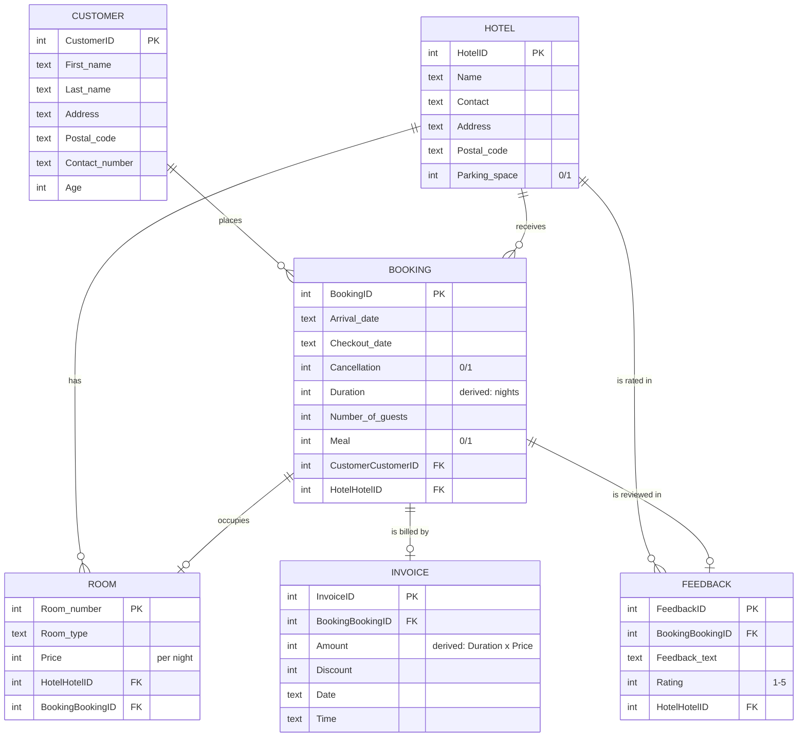

# MAGS — Hotel-Booking Platform with Polyglot Persistence

A back-end data layer for an online hotel-booking agency ("MAGS"), built on **polyglot persistence**: a normalised **SQLite** relational core for transactional bookings and a **MongoDB** document store for the searchable hotel catalogue. Includes a Python CRUD layer, automated invoicing, and booking/ratings analytics.

> Originally built as group coursework for **BEMM459J — Database Technologies for Business Analytics** (University of Exeter Business School). Cleaned up, documented, hardened, and made reproducible for this portfolio. See [Team & my contribution](#team--my-contribution). **Published with my teammates' consent.**

---

## The business problem

An online travel agency needs its data layer to do two jobs that pull in opposite directions:

| Job | Characteristics | Right tool |
|---|---|---|
| **Transactional bookings** | Customers, reservations, invoices, feedback. Correctness and referential integrity are critical — you must not be able to invoice a booking that doesn't exist. | A **relational** database with ACID guarantees and foreign keys. |
| **Catalogue search** | A read-heavy, schema-flexible hotel directory (name, stars, city, country) queried constantly by shoppers. | A **document** store optimised for flexible, fast reads. |

Forcing both into one engine compromises one of them. This project demonstrates using **the right store for each workload** — the core idea behind polyglot persistence.

## Datastore-choice rationale

| Concern | SQLite (relational core) | MongoDB (catalogue) |
|---|---|---|
| Primary use | Transactions: bookings, invoices, feedback | Search/browse: hotel directory |
| Data shape | Highly structured, 3NF, many relationships | Semi-structured, few relationships, evolves over time |
| Integrity | **Foreign keys enforced**; ACID | Eventual/flexible; no cross-document FKs needed |
| Access pattern | Joins + aggregations for analytics | High-volume key/field reads |
| Why chosen here | Invoicing logic depends on joins across Booking/Room; correctness matters | Catalogue fields change without migrations; reads dominate |

## Results at a glance

- A normalised **6-table 3NF schema** with enforced foreign keys (zero orphaned rows on build).
- A reusable, **parameterised** Python CRUD layer over SQLite (SQL-injection–safe).
- Automated **invoice generation**: `Amount = nights stayed × nightly room price`.
- Descriptive analytics over synthetic data: **average bill ≈ £1.4k–£2.1k per stay**, **bookings-per-hotel** frequency, and a **hotel ranking by guest rating** (top hotels score 5/5).
- A parallel **MongoDB** catalogue that runs against a live server *or* an in-memory `mongomock` stand-in — so the whole project is reproducible with no database daemon.

## Data model (6-table 3NF schema)



### Data dictionary

| Table | Column | Type | Key | Notes |
|---|---|---|---|---|
| **Customer** | CustomerID | INTEGER | PK | |
| | First_name / Last_name | TEXT | | |
| | Address / Postal_code | TEXT | | |
| | Contact_number | TEXT | | stored as text to preserve leading digits |
| | Age | INTEGER | | `CHECK (Age >= 0)` |
| **Hotel** | HotelID | INTEGER | PK | |
| | Name | TEXT | | not null |
| | Contact / Address / Postal_code | TEXT | | |
| | Parking_space | INTEGER | | boolean `0/1` |
| **Booking** | BookingID | INTEGER | PK | |
| | Arrival_date / Checkout_date | TEXT | | ISO 8601 `YYYY-MM-DD` |
| | Cancellation / Meal | INTEGER | | boolean `0/1` |
| | Duration | INTEGER | | **derived** — nights between dates |
| | Number_of_guests | INTEGER | | |
| | CustomerCustomerID | INTEGER | FK → Customer | not null |
| | HotelHotelID | INTEGER | FK → Hotel | not null |
| **Room** | Room_number | INTEGER | PK | |
| | Room_type | TEXT | | Single / Double / Triple / Studio |
| | Price | INTEGER | | per-night price |
| | HotelHotelID | INTEGER | FK → Hotel | |
| | BookingBookingID | INTEGER | FK → Booking | |
| **Invoice** | InvoiceID | INTEGER | PK | |
| | BookingBookingID | INTEGER | FK → Booking | not null |
| | Amount | INTEGER | | **derived** — `Duration × Price` |
| | Discount | INTEGER | | |
| | Date / Time | TEXT | | |
| **Feedback** | FeedbackID | INTEGER | PK | |
| | BookingBookingID | INTEGER | FK → Booking | |
| | Feedback_text | TEXT | | |
| | Rating | INTEGER | | `CHECK (Rating BETWEEN 1 AND 5)` |
| | HotelHotelID | INTEGER | FK → Hotel | not null |

## Tech stack

`Python` · `SQLite` (`sqlite3`) · `MongoDB` (`pymongo` / `mongomock`) · `pandas` · `seaborn` · `Jupyter`

## Repository layout

```
hotel-booking-polyglot-db/
├── notebooks/
│   └── hotel_booking_polyglot_db.ipynb   # documented, runs top-to-bottom
├── sql/
│   └── seed.sql                          # builds + seeds data/hotel.db from scratch
├── app.py                                # interactive console CRUD menu
├── db.py                                 # shared, parameterised SQLite helpers
├── requirements.txt
├── LICENSE                               # MIT
└── README.md
```

## How to run

```bash
# 1. Install dependencies (a virtual environment is recommended)
python -m venv .venv && source .venv/bin/activate   # Windows: .venv\Scripts\activate
pip install -r requirements.txt

# 2. Build and seed the relational database
sqlite3 data/hotel.db < sql/seed.sql
#   (no sqlite3 CLI? the notebook's setup cell rebuilds the DB for you)

# 3a. Explore the analysis notebook (runs top-to-bottom, no input needed)
jupyter notebook notebooks/hotel_booking_polyglot_db.ipynb

# 3b. ...or use the interactive admin menu
python app.py
```

**MongoDB is optional.** If a server is running on `localhost:27017` the NoSQL section uses it; otherwise it falls back automatically to an in-memory `mongomock` client, so everything still runs.

## Team & my contribution

This was a **four-person group project**. Credit to my teammates:

- **Ayush Apoorva**
- **Guldana Sakiyeva**
- **Meet Shah**
- **Sachin Sharma** (this repository's author)

**My contribution.** I owned the **relational layer and the analytics**: the 3NF schema design for the six core tables, the Python CRUD helpers over SQLite, the invoice-derivation logic (duration × nightly price), and the booking/ratings analysis. The MongoDB catalogue module was a collaborative effort across the group. The clean-up, hardening (parameterised queries), reproducibility work (seed script, `mongomock` fallback), and documentation in *this* repository are mine.

> **Published with my teammates' consent.** This version has been reworked for a portfolio; the original submission was a shared notebook.

## Limitations & next steps

- **Synthetic data.** All customers, hotels, bookings and feedback are fictional and generated for demonstration. Figures (e.g. average bill) are illustrative, not real-world.
- **Single-node.** Both stores run on a single node with no replication, sharding, or concurrency/connection-pool tuning.
- **No authentication or access control.** This is a coursework data layer, not a hardened production service.
- **No automated tests / API.** Next steps would be a test suite around `db.py`, a thin REST API over the CRUD layer, and an explicit sync path between the relational core and the MongoDB catalogue.

## License

[MIT](LICENSE) © 2026 Sachin Sharma. Coursework collaborators credited above.
